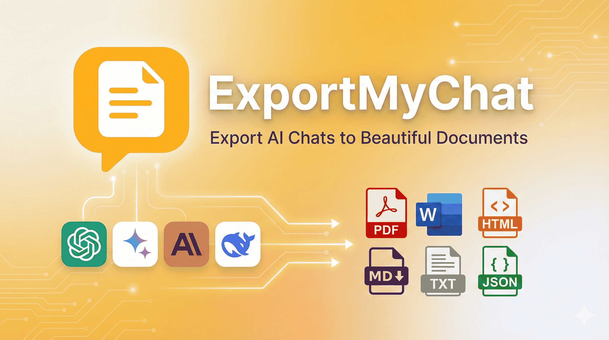

# ExportMyChat - AI Chat Editor & Exporter

<div align="center">
  
</div>

A powerful browser extension that transforms AI chat conversations into beautifully formatted Documents(**pdf**, **docx**, **html**, **md**, **json**, **txt**). Supports **ChatGPT**, **Claude**, **Gemini**, and **DeepSeek** with rich text editing, message management, backup/restore, cloud sync, and extensive customization capabilities.

<div align="center">
    
</div>

## Table of Contents

-   [Features](#features)
-   [Installation](#installation)
-   [Getting Started](#getting-started)
-   [Content Editing](#content-editing)
-   [Layout Options](#layout-options)
-   [Customization](#customization)
-   [Saving & Managing](#saving--managing)
-   [Google Drive Sync](#google-drive-sync)
-   [Architecture](#architecture)
-   [Tech Stack](#tech-stack)
-   [Project Structure](#project-structure)
-   [Development](#development)
-   [Build & Distribution](#build--distribution)
-   [Contributing](#contributing)
-   [Support](#support)
-   [FAQ](#faq)

---

## Features

### Core Features

-   **Multi-Platform Support**: ChatGPT, Claude, Gemini, and DeepSeek - all in one extension
-   **One-Click Export**: Export conversations with a single click from any supported platform
-   Supports exporting individual response, artifact and Even Entire chat.
-   **Content Editing**: Powerful inline editor that lets insert various elements apart from editing existing one.
-   **Advanced Message Management**:
    -   Select/deselect individual messages to include/exclude from the export
    -   Drag-and-drop reordering with real-time preview
    -   Hash-based message tracking for reliable state management
-   **Cloud Sync:** Save your chats and style presets to **Google Drive** and sync across all your devices. Your data remains under your control in your personal Google Drive.
-   **Backup & Restore**:
    -   Export all of your chats in bulk as JSON for backup
    -   Import chats from JSON files on any device with the extension
    -   Restore your entire chat library with one click
-   **Chat Management**:
    -   Save unlimited chats locally
    -   Merge multiple conversations
    -   Load and re-export with different settings
-   **Multiple Layout Options**: Chat (bubble), Q&A (structured), Document (formal)
-   **Extensive Customization**: Colors, fonts, spacing, bubble styles, margins, headers/footers, background
-   **Preset System**: Save and reuse styling configurations
-   **Theme Support**: Light/Dark mode with system detection
-   **Multi-language support**: We support 15 different languages including (English, Spanish, French, German, Italian, Portuguese, Russian, Chinese, Japanese, Korean, Arabic, Hindi, Dutch, Turkish, and Polish)
-   **Media Handling**: Include/exclude generated images by the chat models.
-   **Artifact Support**: Export Claude Artifacts and Gemini code blocks.

## Installation

### From Source

1. **Clone the repository**:

```bash
git clone https://github.com/kanhaiyadav/ExportMyChat.git
cd ExportMyChat
```

2. **Install dependencies**:

```bash
npm install
```

3. **Build the extension**:

```bash
npm run build
```

4. **Load in Chromimum browsers**:

-   Open `chrome://extensions/`
-   Enable "Developer mode" (top-right)
-   Click "Load unpacked"
-   Select the `.output/chrome-mv3` directory

### Development Mode

For development with hot-reload:

```bash
npm run dev
```

Then follow the same steps to load in Chrome, but the extension will auto-update as you make changes.

### Firefox

To build for Firefox:

```bash
npm run build:firefox
```

---

## Getting Started

### Step 1: Export a Chat

1. Navigate to any chat on **ChatGPT**, **Claude**, **Gemini**, or **DeepSeek**
2. Click the **"ExportMyChat"** button that appears in the conversation header, or to export individual response (message) click on the ExportToChat logo in the action bar below each response.
3. The extension automatically opens with your chat data pre-loaded and ready to customize

### Step 2: Review & Edit (Optional)

-   All messages are automatically loaded and selected
-   Use the **"Message Management"** panel to:
    -   Select/deselect specific messages
    -   Drag and drop to reorder messages

### Step 3: Customize (Optional)

-   Choose your preferred layout (Chat, Q&A, or Document)
-   Adjust colors, fonts, spacing, and styling
-   Configure headers, footers, and margins
-   Merge different chats into one.
-   Preview changes in real-time on the right panel

### Step 4: Export, Save, or Backup

-   **Export to different formats**: Click on Export dropdown to see all the available file formats to export in.
-   **Save Chat**: Store chat locally for future editing/re-export
-   **Backup Chat**: Export as JSON file for backup/sharing
-   **Save Preset**: Save your styling settings for quick reuse

---

#### Supported Platforms

**Fully Supported:**

-   **ChatGPT** (chatgpt.com, chat.openai.com)
    -   Standard messages, code blocks, images
    -   Multi-turn conversations
-   **Claude** (claude.ai)
    -   Messages, Artifacts (code/documents)
-   **Gemini** (gemini.google.com)
    -   Messages, code blocks, embedded code editors
    -   Monaco editor content extraction
-   **DeepSeek** (chat.deepseek.com)
    -   Messages, code blocks

---

### Content Editing

A powerful rich text editor with comprehensive formatting tools for inline editing of chat messages.

| Tool        | Description                     |
| ----------- | ------------------------------- |
| Undo/Redo   | Undo or redo changes            |
| Bold        | Make text bold                  |
| Italic      | Make text italic                |
| Underline   | Underline text                  |
| Subscript   | Create subscript text           |
| Superscript | Create superscript text         |
| Alignment   | Left, center, right, or justify |
| Headings    | H1, H2, H3 headings             |
| Lists       | Bullet or ordered lists         |
| Code Block  | Insert code blocks              |
| Links       | Insert hyperlinks               |
| Tables      | Insert and format tables        |
| Images      | Insert images with URLs         |
| Separator   | Horizontal divider line         |

**How to Edit**:

1. Enable editing mode by clicking the edit icon in the preview toolbar
2. Click on any message in the preview to start editing
3. Use the editor toolbar to format text and insert elements
4. Changes are reflected in real-time

---

### Layout Options

#### 1. Chat Layout

-   Bubble-style conversation format
-   User messages on the right, AI on the left
-   Customizable colors, styles, and avatars
-   Best for: Preserving natural conversation flow

#### 2. Q&A Layout

-   Clean question-answer format
-   Optional numbering and custom prefixes
-   Separator styles (line, dots, or none)
-   Best for: Educational content and reports

#### 3. Document Layout

-   Traditional document format
-   Title and body color differentiation
-   Professional appearance
-   Best for: Formal documents and reports

---

### Customization

#### Layout-Specific Settings

-   **Chat**: Bubble colors, styles, spacing, avatars, fonts
-   **Q&A**: Question/answer colors, separators, numbering, prefixes
-   **Document**: Title/body colors, fonts, line height, spacing

#### General Settings

-   Background, font size.
-   Header
-   Font family and size
-   Media inclusion options

#### Preset Management

-   **Save Preset**: Store current settings for reuse
-   **Load Preset**: Apply saved settings instantly
-   **Edit/Delete**: Manage your presets
-   **Duplicate**: Create variations

---

### Saving & Managing

#### Save Chat

Store a chat conversation locally with current settings:

1. Click **"Save Chat"** in the preview toolbar
2. Enter a descriptive name
3. Access anytime from **Saved Chats Management** panel in sidebar
4. Load to edit and re-export with different settings

#### Backup & Restore

**Export All Chat (Backup)**:

-   Export individual chat as JSON file
-   Includes all messages, metadata, and settings
-   Shareable and portable across devices
-   Access via sidebar "Import Chat" option

**Import Chat (Restore)**:

-   Import previously exported JSON files
-   Automatically validates and loads chat data
-   Preserves all message content and metadata
-   Access via sidebar "Import Chat" option

#### Save Preset

Store styling settings for quick reuse:

1. Customize layout, colors, fonts, and spacing
2. Click **"Save Preset"**
3. Name your preset (e.g., "Professional Report", "Colorful Chat")
4. Load instantly from Preset Management panel
5. Use **Save As** to create variations

#### Merge Chats

Combine multiple saved chats into one conversation:

1. Select chats to merge from Saved Chats panel
2. Choose merge order
3. Creates new unified chat
4. Useful for combining related conversations

#### Management Panels

**Saved Chats Management** (Sidebar):

-   View all locally saved chats
-   Load, edit, delete, duplicate.
-   Filter by source platform (ChatGPT, Claude, etc.)
-   Sort by date or name
-   Quick preview of message count

**Preset Management** (Sidebar):

-   Browse all saved styling presets
-   Load, edit, delete, or duplicate
-   Preview preset details
-   Quick apply to current chat

---

### Google Drive Sync

Seamlessly sync your chats and presets across all your devices using Google Drive.

#### Features

-   **Two-Way Sync**: Changes sync automatically between local storage and Google Drive
-   **Secure**: All data is stored in your personal Google Drive under your control
-   **Automatic Conflict Resolution**: Smart merging when changes occur on multiple devices
-   **Selective Sync**: Choose to sync chats, presets, or both
-   **Sync Indicator**: Visual status showing sync state (synced, syncing, errors)

#### How to Use

1. Click the Google Drive icon in the header
2. Sign in with your Google account through the secure authentication page
3. Copy the provided session token
4. Paste the token back in the extension to complete authentication
5. Enable sync for chats and/or presets
6. Your data automatically syncs across all devices

#### Sync Options

-   **Sync Chats**: Sync all saved chats to Google Drive
-   **Sync Presets**: Sync all style presets to Google Drive
-   **Auto Sync**: Automatically sync changes in real-time
-   **Manual Sync**: Trigger sync manually when needed
-   **Clear Cloud Data**: Remove all synced data from Google Drive

---

## Architecture

### Data Flow

```
Chat Export → Extract Data → Load in Options Page
→ Initialize State → User Actions (Edit/Select/Reorder)
→ Update Preview → Save/Export → Persist to DB or Generate PDF
```

### Component Hierarchy

```
App.tsx (Main)
├── Header (Logo, Language Switcher, Theme, Social Links)
├── SidebarProvider
│   ├── AppSidebar
│   │   ├── nav-main (Main Navigation)
│   │   ├── nav-chats (Saved Chats)
│   │   └── nav-presets (Saved Presets)
│   └── SidebarInset
│       ├── PreviewContainer
│       │   ├── PreviewToolbar (Save/Export Buttons)
│       │   └── Layout Renderers (ChatLayout/QALayout/DocumentLayout)
│       └── Settings Area
│           ├── SettingsPanel
│           │   ├── LayoutSelection
│           │   ├── ChatSettings
│           │   ├── QASettings
│           │   ├── DocumentSettings
│           │   └── GeneralSettings
│           ├── EditorPanel (Overlay - Rich Text Editor)
│           └── MessageManagementPanel (Overlay - Message List/Edit/Reorder)
├── SaveChatDialog
├── SavePresetDialog
├── UnsavedChangesDialog
├── MergeChatsDialog
├── ConfirmationDialog
├── BulkExportChatsDialog
└── ImportChatDialog
```

---

## Tech Stack

### Frontend

-   React 19.1
-   TypeScript 5.9
-   Vite (via WXT build tool)

### UI & Styling

-   Shadcn/ui (components)
-   Tailwind CSS 4 (styling)
-   Radix UI (primitives)
-   Lucide React (icons)

### Database & State

-   Dexie 4 (IndexedDB)
-   dexie-react-hooks
-   Chrome Storage API
-   Google Drive API (cloud sync)
-   Google Drive API

### Interactive Features

-   @dnd-kit (drag-and-drop for message reordering)
-   ContentEditable API (rich text editing)
-   i18next (internationalization)

### Chrome Extension

-   WXT 0.20 (framework)
-   Manifest V3 (standard)

---

## Project Structure

```
C2Pdf_wxt/
├── entrypoints/
│   ├── background.ts              # Service worker
│   ├── content.ts                 # Content script (chat pages)
│   ├── options/                   # Main extension UI
│   │   ├── App.tsx                # Main component
│   │   ├── Header.tsx             # Navigation bar
│   │   ├── app-sidebar.tsx        # Application sidebar
│   │   ├── Editor.tsx             # Rich text editor
│   │   ├── EditorPanel.tsx        # Editor panel wrapper
│   │   ├── EditorToolbar.tsx      # Editor toolbar
│   │   ├── EditorForms.tsx        # Editor forms
│   │   ├── MessageManagementPanel.tsx  # Message list/edit
│   │   ├── SettingsPanel.tsx      # Settings container
│   │   ├── ChatSettings.tsx       # Chat settings
│   │   ├── QASettings.tsx         # Q&A settings
│   │   ├── DocumentSettings.tsx   # Document settings
│   │   ├── GeneralSettings.tsx    # General settings
│   │   ├── LayoutSelection.tsx    # Layout selector
│   │   ├── PreviewContainer.tsx   # PDF preview
│   │   ├── PreviewToolbar.tsx     # Preview toolbar
│   │   ├── ChatLayout.tsx         # Chat layout
│   │   ├── QALayout.tsx           # Q&A layout
│   │   ├── DocumentLayout.tsx     # Document layout
│   │   ├── SaveChatDialog.tsx     # Save chat modal
│   │   ├── ExportChatDialog.tsx   # Export chat modal
│   │   ├── ImportChatDialog.tsx   # Import chat modal
│   │   ├── SavePresetDialog.tsx   # Save preset modal
│   │   ├── MergeChatsDialog.tsx   # Merge chats modal
│   │   ├── BulkExportChatsDialog.tsx  # Bulk export modal
│   │   ├── ConfirmationDialog.tsx # Confirmation modal
│   │   ├── UnsavedChangesDialog.tsx  # Unsaved changes modal
│   │   ├── SavedChatsManagement.tsx  # Saved chats management
│   │   ├── PresetManagement.tsx   # Preset management
│   │   ├── nav-main.tsx           # Main navigation
│   │   ├── nav-chats.tsx          # Chats navigation
│   │   ├── nav-presets.tsx        # Presets navigation
│   │   ├── team-switcher.tsx      # Team switcher component
│   │   ├── types.ts               # TypeScript types
│   │   ├── utils.tsx              # Utility functions
│   │   ├── main.tsx               # Entry point
│   │   ├── style.css              # Styles
│   │   └── index.html             # HTML template
│   └── popup/                     # Browser action popup
│       ├── App.tsx                # Popup component
│       ├── main.tsx               # Entry point
│       ├── App.css                # Popup styles
│       ├── style.css              # Global popup styles
│       └── index.html             # Popup HTML
│
├── components/                    # Reusable components
│   ├── ThemeToggle.tsx            # Theme switcher
│   ├── LanguageSelector.tsx       # Language selector
│   ├── BuyMeCoffeeModal.tsx       # Buy me coffee modal
│   ├── GoogleDriveSyncModal.tsx   # Google Drive sync modal
│   ├── GoogleDriveSyncSettings.tsx # Google Drive settings
│   ├── SyncStatusIndicator.tsx    # Sync status indicator
│   └── ui/                        # Shadcn/ui components
│
├── hooks/
│   ├── use-mobile.ts              # Mobile detection hook
│   └── use-toast.ts               # Toast notification hook
│
├── lib/
│   ├── settingsDB.ts              # Database operations
│   ├── googleDriveSync.ts         # Google Drive sync
│   ├── useTheme.ts                # Theme hook
│   ├── themeStorage.ts            # Theme storage
│   ├── utils.ts                   # Utilities
│   └── i18n/                      # Internationalization
│       ├── config.ts              # i18n configuration
│       └── locales/               # Language files
│           ├── en.json            # English
│           ├── es.json            # Spanish
│           ├── fr.json            # French
│           ├── de.json            # German
│           ├── it.json            # Italian
│           ├── pt.json            # Portuguese
│           ├── ru.json            # Russian
│           ├── zh.json            # Chinese
│           ├── ja.json            # Japanese
│           ├── ko.json            # Korean
│           ├── ar.json            # Arabic
│           ├── hi.json            # Hindi
│           ├── nl.json            # Dutch
│           ├── pl.json            # Polish
│           └── tr.json            # Turkish
│
├── assets/
│   └── tailwind.css               # Tailwind styles
│
├── public/                        # Static assets
│   ├── monaco-extractor.js        # Monaco editor extractor
│   ├── icon/                      # Extension icons
│   ├── chat/                      # Chat images
│   └── side/                      # Sidebar images
│
├── ARCHITECTURE.md                # Architecture documentation
├── components.json                # Shadcn components config
├── generate-key.js                # Extension key generator
├── wxt.config.ts                  # WXT config
├── tsconfig.json                  # TypeScript config
├── postcss.config.mjs             # PostCSS config
└── package.json                   # Dependencies
```

---

## Development

### Prerequisites

-   Node.js 16+
-   npm 7+
-   Chrome browser

### Setup

```bash
git clone https://github.com/kanhaiyadav/ExportMyChat.git
cd ExportMyChat
npm install
npm run dev
```

Then load `.output/chrome-mv3` in Chrome.

### Development Workflow

1. Make code changes
2. Vite handles compilation with HMR
3. Reload extension in Chrome
4. Changes reflect in preview

### Building

```bash
# Production build
npm run build

# Create zip for distribution
npm run zip

# Firefox build
npm run build:firefox
```

### Code Quality

```bash
# Type checking
npm run compile
```

---

## Build & Distribution

### Build Process

```bash
npm run build              # Chrome MV3
npm run build:firefox      # Firefox
npm run zip                # Create distribution zip
```

### Output

```
.output/
├── chrome-mv3/            # Chrome extension
└── firefox-mv2/           # Firefox extension
```

### Publishing

**Chrome Web Store**:

1. Zip the `chrome-mv3` directory
2. Upload to [Chrome Web Store Developer Dashboard](https://chrome.google.com/webstore/developer/dashboard)
3. Submit for review

---

## Contributing

We welcome contributions!

1. Fork the repository
2. Create a feature branch: `git checkout -b feature/amazing-feature`
3. Make your changes
4. Commit: `git commit -m 'Add amazing feature'`
5. Push: `git push origin feature/amazing-feature`
6. Open a Pull Request

### Code Style

-   Use TypeScript for type safety
-   Follow React hooks best practices
-   Use Shadcn/ui components
-   Keep components focused
-   Test your changes

---

## Support

### Getting Help

-   **GitHub Issues**: [Report bugs or request features](https://github.com/kanhaiyadav/ExportMyChat/issues)
-   **Feedback Form**: Use the feedback button in the extension
-   **Buy Me Coffee**: Support development
-   **Star the repo**: Show your support!

### Troubleshooting

**Export button not appearing**:

-   Ensure chat page is fully loaded
-   Verify you're on a supported platform (ChatGPT, Claude, Gemini, or DeepSeek)
-   Check browser console for errors (F12)
-   Refresh the page and wait a few seconds

**Messages not loading**:

-   Reload the extension: `chrome://extensions` → reload ExportMyChat
-   Verify chat has messages
-   Refresh the chat page
-   Check if content script is running (console should show initialization logs)

**PDF export issues**:

-   Extra margin on the right side: Refresh the page and try to re-export.
-   Verify at least one message is selected
-   Check all settings are valid (colors, fonts, etc.)
-   Try different layouts (Chat, Q&A, Document)
-   Clear browser cache and try again
-   Disable other extensions temporarily to test for conflicts

**Settings not saving**:

-   Check browser storage quota: `chrome://settings/content/all`
-   Verify IndexedDB is enabled
-   Try clearing extension data and re-saving
-   Check for browser privacy settings that might block storage

**Drag-and-drop not working**:

-   Ensure message list is not scrolling during drag
-   Try refreshing the extension
-   Check if messages are properly loaded
-   Clear cache and reload

**Import failing**:

-   Verify JSON file is valid (not corrupted)
-   Check file was exported from ExportMyChat
-   Try importing a smaller file first
-   Check browser console for specific errors

**Claude Artifacts not showing**:

-   Ensure Artifact is fully loaded before clicking "Export Chat"
-   Look for "Include in Export" button on Artifact
-   Refresh page if Artifact doesn't appear
-   Check console for extraction errors

---

## FAQ

**Q: Is my chat data secure?**
A: Yes! All data is stored locally in your browser's IndexedDB. If you use Google Drive sync, data is encrypted and stored in your personal Google Drive under your control. Your conversations never leave your device except when you explicitly enable cloud sync.

**Q: Does this work with all AI chat platforms?**
A: Currently supports ChatGPT, Claude, Gemini, and DeepSeek. We're actively monitoring new platforms and community requests for future additions.

**Q: Can I export chats from one platform and import them on another?**
A: Yes! The backup/export feature creates JSON files that can be imported regardless of the original source platform.

**Q: How do I backup my chats?**
A: Use the "Backup Chats" button to create JSON backups. For single use the json type file export. These json export can be used to import the chats/chat whenever and whereever you want.

**Q: Can I edit exported PDFs?**
A: PDFs are final documents. Edit content before exporting using the Rich Text Editor in Message Management.

**Q: How do I merge multiple chats?**
A: Save the chats you want to merge, then use the "Merge Chats" feature in the Saved Chats Management panel.

**Q: What if I clear browser data?**
A: Saved chats stored in IndexedDB will be lost unless you've enabled Google Drive sync. We recommend either enabling cloud sync or regularly exporting important chats as JSON backups.

**Q: How do I Export Claude/gemini Artifacts?**
A: Artifacts can be individually exported using Export Artifact button just in the artifact header.

**Q: Can I share my exported chats?**
A: Yes! Export as JSON and share the file. Recipients can import it using the "Import Chat" feature.

**Q: How do I report bugs?**
A: Open an issue on [GitHub](https://github.com/kanhaiyadav/ExportMyChat/issues) with details and screenshots.

**Q: Can I contribute?**
A: Absolutely! See the Contributing section. We welcome code, documentation, and feature suggestions.

**Q: How does Google Drive sync work?**
A: When you enable Google Drive sync, the extension stores your chats and presets in your personal Google Drive. The data is automatically synced across all devices where you use the extension with the same Google account. You maintain full control and can delete the data anytime.

**Q: Is Google Drive sync secure?**
A: Yes! Data is stored in your personal Google Drive under your control. The extension only accesses the app folder it creates and cannot access any other files in your Drive.

---

## Connect

-   **GitHub**: [@kanhaiyadav](https://github.com/kanhaiyadav)
-   **Project**: [Ai-Chat-Editor-Exporter](https://github.com/kanhaiyadav/ExportMyChat)
-   **Issues**: [Report bugs](https://github.com/kanhaiyadav/ExportMyChat/issues)

---

**Made with ❤️ by Kanhaiya Yadav**
