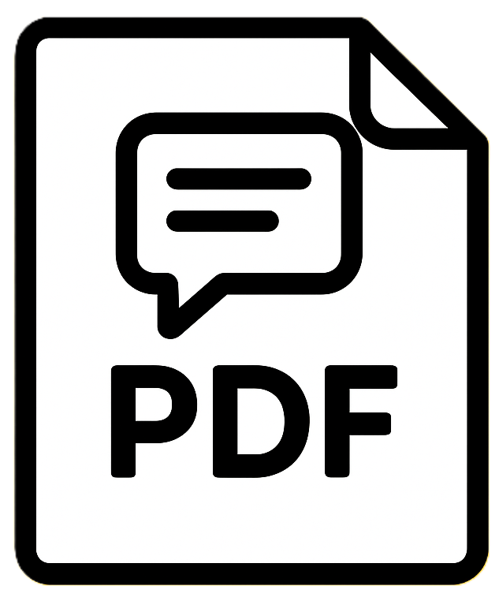

# Chat2Pdf - AI Chat Editor & Exporter

<div align="center">
  
</div>

A powerful browser extension that transforms AI chat conversations into beautifully formatted PDFs. Currently supports exporting ChatGPT conversations with rich text editing, customization, and export capabilities. Support for Claude, Gemini, DeepSeek, and other platforms is planned for future releases.

## Table of Contents

-   [Features](#features)
-   [Installation](#installation)
-   [Getting Started](#getting-started)
-   [User Guide](#user-guide)
-   [Architecture](#architecture)
-   [Tech Stack](#tech-stack)
-   [Project Structure](#project-structure)
-   [Development](#development)
-   [Build & Distribution](#build--distribution)
-   [Contributing](#contributing)
-   [Support](#support)

---

## Features

### Core Features

-   **One-Click Export**: Export ChatGPT conversations with a single click
-   **Rich Text Editing**: Edit individual messages with a powerful inline editor supporting formatting, code blocks, and lists
-   **Message Management**: Select/deselect messages, reorder with drag-and-drop, edit content with real-time preview
-   **Multiple Layout Options**: Chat (bubble), Q&A (structured), Document (formal)
-   **PDF Customization**: Colors, fonts, spacing, bubbles styles, margins, headers/footers
-   **Save & Manage**: Save presets and chats, load/re-export, merge conversations
-   **Theme Support**: Light/Dark mode with system detection
-   **Media Handling**: Include/exclude images and attachments
-   **Future Platform Support**: Claude, Gemini, DeepSeek, and other AI chat platforms (coming soon)

### UI/UX Features

-   Intuitive sidebar navigation
-   Collapsible settings sections
-   Real-time preview of changes
-   Responsive design
-   Accessibility-focused components
-   Keyboard shortcuts support

---

## Installation

### From Source

1. **Clone the repository**:

```bash
git clone https://github.com/kanhaiyadav/Chat2Pdf.git
cd Ai-Chat-Editor-Exporter
```

2. **Install dependencies**:

```bash
npm install
```

3. **Build the extension**:

```bash
npm run build
```

4. **Load in Chromimum browsers**:

-   Open `chrome://extensions/`
-   Enable "Developer mode" (top-right)
-   Click "Load unpacked"
-   Select the `.output/chrome-mv3` directory

### Development Mode

For development with hot-reload:

```bash
npm run dev
```

Then follow the same steps to load in Chrome, but the extension will auto-update as you make changes.

### Firefox

To build for Firefox:

```bash
npm run build:firefox
```

---

## Getting Started

### Step 1: Export a Chat

1. Navigate to any chat on ChatGPT, Claude, Gemini, or DeepSeek
2. Click the **"Export Chat"** button in the conversation header
3. The extension opens the options page with your chat data pre-loaded

### Step 2: Review & Edit (Optional)

-   Messages are automatically loaded and selected
-   Use the **"Message Management"** panel to select, edit, or reorder messages

### Step 3: Customize (Optional)

-   Choose your preferred layout (Chat, Q&A, or Document)
-   Adjust colors, fonts, spacing, and styling
-   Preview changes in real-time

### Step 4: Export or Save

-   **Export to PDF**: Click "Export PDF" to download immediately
-   **Save Chat**: Save for future reference with current settings
-   **Save Preset**: Save your styling settings for reuse

---

## User Guide

### Exporting Chats

#### Initial Export

1. Click the **"Export Chat"** button that appears in the chat header
2. The extension automatically extracts all messages, title, images, and attachments

#### Supported Platforms

**Currently Supported:**

-   ChatGPT (chatgpt.com, chat.openai.com)

**Planned Support (Coming Soon):**

-   Claude (claude.ai)
-   Gemini (gemini.google.com)
-   DeepSeek (chat.deepseek.com)
-   Other AI chat platforms

---

### Chat Editor

The Chat Editor provides rich text editing capabilities:

| Tool          | Description             |
| ------------- | ----------------------- |
| Bold          | Make text bold          |
| Italic        | Make text italic        |
| Strikethrough | Strike text             |
| Inline Code   | Code snippet            |
| Code Block    | Full code block         |
| Lists         | Bullet or ordered lists |
| Undo/Redo     | Undo/Redo changes       |

**How to Edit**: Click the Edit icon next to a message, make changes, and click Save.

---

### Message Management

**Features**:

-   Select/deselect messages to include in export
-   Reorder messages using drag-and-drop
-   Edit message content with rich text editor
-   Visual feedback with role-based color coding

---

### Layout Options

#### 1. Chat Layout

-   Bubble-style conversation format
-   User messages on the right, AI on the left
-   Customizable colors, styles, and avatars
-   Best for: Preserving natural conversation flow

#### 2. Q&A Layout

-   Clean question-answer format
-   Optional numbering and custom prefixes
-   Separator styles (line, dots, or none)
-   Best for: Educational content and reports

#### 3. Document Layout

-   Traditional document format
-   Title and body color differentiation
-   Professional appearance
-   Best for: Formal documents and reports

---

### Customization

#### Layout-Specific Settings

-   **Chat**: Bubble colors, styles, spacing, avatars, fonts
-   **Q&A**: Question/answer colors, separators, numbering, prefixes
-   **Document**: Title/body colors, fonts, line height, spacing

#### General Settings

-   Background and text colors
-   Page size (A4, Letter, Legal)
-   Margins and spacing
-   Header and footer options
-   Font family and size
-   Media inclusion options

#### Preset Management

-   **Save Preset**: Store current settings for reuse
-   **Load Preset**: Apply saved settings instantly
-   **Edit/Delete**: Manage your presets
-   **Duplicate**: Create variations

---

### Saving & Managing

#### Save Chat

Store a chat conversation with current settings:

1. Click **"Save Chat"**
2. Enter a name
3. Access from **Saved Chats Management** panel

#### Save Preset

Store styling settings for reuse:

1. Customize settings
2. Click **"Save Preset"**
3. Use **Save As** for variations

#### Merge Chats

Combine multiple saved chats into one conversation.

#### Management Panels

-   View and manage all saved chats and presets
-   Load, edit, delete, or duplicate items
-   Filter by source platform

---

## Architecture

### Data Flow

```
Chat Export → Extract Data → Load in Options Page
→ Initialize State → User Actions (Edit/Select/Reorder)
→ Update Preview → Save/Export → Persist to DB or Generate PDF
```

### Component Hierarchy

```
App.tsx (Main)
├── Header (Logo, Theme, Social Links)
├── Sidebar (Saved Chats, Presets)
├── PreviewContainer
│   ├── PreviewToolbar (Save/Export Buttons)
│   └── Layout Preview (Chat/QA/Document)
└── SettingsPanel
    ├── MessageManagement (Edit/Reorder/Select)
    ├── LayoutSelector
    ├── ChatSettings
    ├── QASettings
    ├── DocumentSettings
    └── GeneralSettings
```

---

## Tech Stack

### Frontend

-   React 19.1
-   TypeScript 5.9
-   Vite (build tool)

### UI & Styling

-   Shadcn/ui (components)
-   Tailwind CSS 4 (styling)
-   Radix UI (primitives)
-   Lucide React (icons)

### Database & State

-   Dexie 4 (IndexedDB)
-   dexie-react-hooks
-   Chrome Storage API

### Interactive Features

-   @dnd-kit (drag-and-drop)
-   ContentEditable API (text editing)

### Chrome Extension

-   WXT 0.20 (framework)
-   Manifest V3 (standard)

---

## Project Structure

```
C2Pdf_wxt/
├── entrypoints/
│   ├── background.ts              # Service worker
│   ├── content.ts                 # Content script (chat pages)
│   └── options/                   # Main extension UI
│       ├── App.tsx                # Main component
│       ├── Header.tsx             # Navigation bar
│       ├── MessageManagement.tsx  # Message list/edit
│       ├── Editor.tsx             # Rich text editor
│       ├── SettingsPanel.tsx      # Settings container
│       ├── ChatSettings.tsx       # Chat settings
│       ├── QASettings.tsx         # Q&A settings
│       ├── DocumentSettings.tsx   # Document settings
│       ├── GeneralSettings.tsx    # General settings
│       ├── PreviewContainer.tsx   # PDF preview
│       ├── ChatLayout.tsx         # Chat layout
│       ├── QALayout.tsx           # Q&A layout
│       ├── DocumentLayout.tsx     # Document layout
│       ├── SaveChatDialog.tsx     # Save chat modal
│       ├── SavePresetDialog.tsx   # Save preset modal
│       ├── MergeChatsDialog.tsx   # Merge chats modal
│       └── types.ts               # TypeScript types
│
├── components/                    # Reusable components
│   ├── Button.tsx
│   ├── ThemeToggle.tsx
│   ├── FeedbackModal.tsx
│   └── ui/                        # Shadcn/ui components
│
├── hooks/
│   └── use-mobile.ts
│
├── lib/
│   ├── settingsDB.ts              # Database operations
│   ├── useTheme.ts                # Theme hook
│   └── utils.ts                   # Utilities
│
├── assets/
│   └── tailwind.css
│
├── public/                        # Static assets
│   ├── icon/
│   ├── chat/
│   └── side/
│
├── wxt.config.ts                  # WXT config
├── tsconfig.json                  # TS config
├── tailwind.config.js             # Tailwind config
└── package.json                   # Dependencies
```

---

## Development

### Prerequisites

-   Node.js 16+
-   npm 7+
-   Chrome browser

### Setup

```bash
git clone https://github.com/kanhaiyadav/Chat2Pdf.git
cd Ai-Chat-Editor-Exporter
npm install
npm run dev
```

Then load `.output/chrome-mv3` in Chrome.

### Development Workflow

1. Make code changes
2. Vite handles compilation with HMR
3. Reload extension in Chrome
4. Changes reflect in preview

### Building

```bash
# Production build
npm run build

# Create zip for distribution
npm run zip

# Firefox build
npm run build:firefox
```

### Code Quality

```bash
# Type checking
npm run compile
```

---

## Build & Distribution

### Build Process

```bash
npm run build              # Chrome MV3
npm run build:firefox      # Firefox
npm run zip                # Create distribution zip
```

### Output

```
.output/
├── chrome-mv3/            # Chrome extension
└── firefox-mv2/           # Firefox extension
```

### Publishing

**Chrome Web Store**:

1. Zip the `chrome-mv3` directory
2. Upload to [Chrome Web Store Developer Dashboard](https://chrome.google.com/webstore/developer/dashboard)
3. Submit for review

**Firefox Add-ons**:

1. Zip the `firefox-mv2` directory
2. Upload to [Firefox Developer Hub](https://addons.mozilla.org/)
3. Submit for review

---

## Contributing

We welcome contributions!

1. Fork the repository
2. Create a feature branch: `git checkout -b feature/amazing-feature`
3. Make your changes
4. Commit: `git commit -m 'Add amazing feature'`
5. Push: `git push origin feature/amazing-feature`
6. Open a Pull Request

### Code Style

-   Use TypeScript for type safety
-   Follow React hooks best practices
-   Use Shadcn/ui components
-   Keep components focused
-   Test your changes

---

## Support

### Getting Help

-   **GitHub Issues**: [Report bugs or request features](https://github.com/kanhaiyadav/Chat2Pdf/issues)
-   **Feedback Form**: Use the feedback button in the extension
-   **Buy Me Coffee**: Support development
-   **Star the repo**: Show your support!

### Troubleshooting

**Export button not appearing**:

-   Ensure chat page is fully loaded
-   Verify you're on ChatGPT (chatgpt.com or chat.openai.com)
-   Check browser console for errors

**Messages not loading**:

-   Reload the extension: `chrome://extensions` → reload
-   Verify chat has messages
-   Refresh the chat page

**PDF export issues**:

-   Verify settings are configured correctly
-   Check at least one message is selected
-   Try different layouts
-   Clear browser cache

**Settings not saving**:

-   Check browser storage quota
-   Verify IndexedDB is enabled
-   Try clearing extension data

---

## FAQ

**Q: Is my chat data secure?**
A: Yes! All data is stored locally. Nothing is sent to external servers.

**Q: Does this work with other chat platforms?**
A: Currently, the extension supports ChatGPT. Support for Claude, Gemini, DeepSeek, and other AI chat platforms is planned for future releases.

**Q: When will support for other platforms be added?**
A: We're actively working on adding support for Claude, Gemini, and DeepSeek. The timeline depends on community feedback and platform specifics. Follow our [GitHub](https://github.com/kanhaiyadav/Chat2Pdf) for updates!

**Q: Can I edit exported PDFs?**
A: Edit before export using the Message Management feature.

**Q: How do I backup my chats?**
A: Export to PDF or check browser backup features. Cloud sync is planned.

**Q: Can I merge multiple chats?**
A: Yes! Use the "Merge Chats" feature.

**Q: What if I clear browser data?**
A: Saved chats will be lost. Export important ones to PDF first.

**Q: How do I report bugs?**
A: Open an issue on [GitHub](https://github.com/kanhaiyadav/Chat2Pdf/issues).

**Q: Can I contribute?**
A: Absolutely! See the Contributing section above.

---

## Version

-   **v13.0.0** (Current): Major release with enhanced message management, rich text editor, and improved UI/UX

---

## Connect

-   **GitHub**: [@kanhaiyadav](https://github.com/kanhaiyadav)
-   **Project**: [Ai-Chat-Editor-Exporter](https://github.com/kanhaiyadav/Chat2Pdf)
-   **Issues**: [Report bugs](https://github.com/kanhaiyadav/Chat2Pdf/issues)

---

**Made with ❤️ by the Chat2Pdf team**
